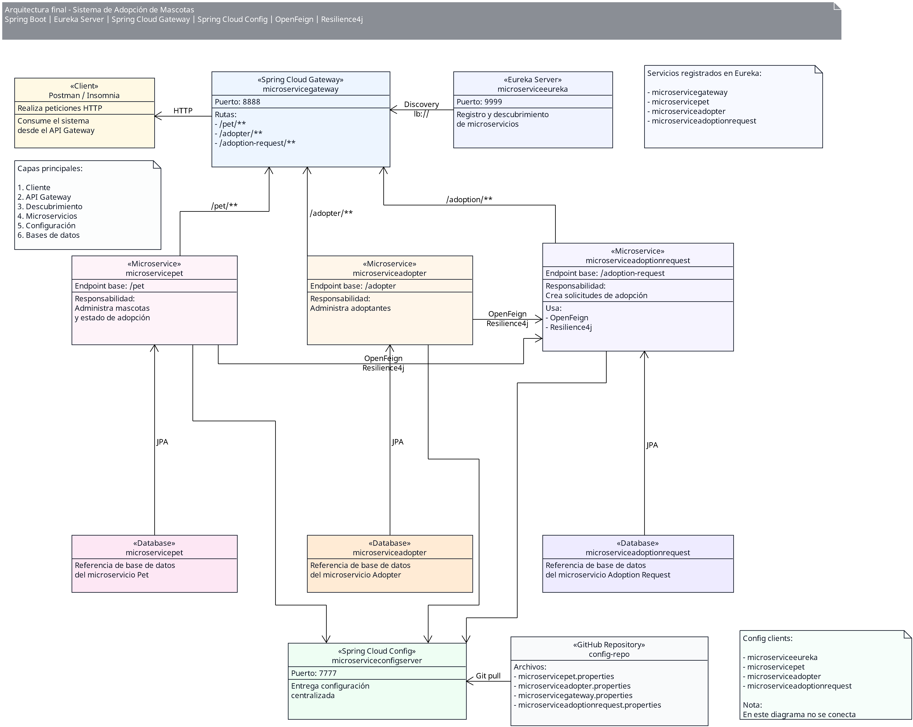

# AdoptaPet

Sistema de adopción de mascotas desarrollado con una arquitectura de microservicios usando **Spring Boot** y **Spring Cloud**.

El proyecto tiene como objetivo mostrar una arquitectura distribuida compuesta por microservicios de negocio, servicios de infraestructura, descubrimiento de servicios, gateway, configuración centralizada, comunicación entre servicios y tolerancia a fallos.

---

## Descripción general

**AdoptaPet** permite administrar un flujo básico de adopción de mascotas.

El sistema está compuesto por tres microservicios principales:

- Administración de mascotas.
- Administración de adoptantes.
- Administración de solicitudes de adopción.

Además, incluye servicios de infraestructura para:

- Descubrimiento de servicios con Eureka.
- Entrada centralizada con Spring Cloud Gateway.
- Configuración centralizada con Spring Cloud Config.
- Comunicación entre microservicios con OpenFeign.
- Tolerancia a fallos con Resilience4j.

---

## Arquitectura general



Servicios de soporte:

```text
Spring Cloud Config Server
Eureka Server
Repositorio GitHub de configuración
```

---

## Módulos del repositorio

```text
AdoptaPet/
├── MicroserviceAdopter/
├── MicroserviceAdoptionRequest/
├── MicroserviceConfig/
├── MicroserviceEureka/
├── MicroserviceGateway/
├── MicroservicePet/
└── docs/
```

---

## Microservicios

| Módulo | Nombre del servicio | Responsabilidad | Puerto |
|---|---|---|---|
| `MicroserviceConfig` | `microserviceconfig` | Servidor de configuración centralizada | `7777` |
| `MicroserviceEureka` | `microserviceeureka` | Servidor de descubrimiento de servicios | `9999` |
| `MicroserviceGateway` | `microservicegateway` | Puerta de entrada a la arquitectura | `8888` |
| `MicroservicePet` | `microservicepet` | Administración de mascotas | `9091` |
| `MicroserviceAdopter` | `microserviceadopter` | Administración de adoptantes | `9092` |
| `MicroserviceAdoptionRequest` | `microserviceadoptionrequest` | Administración de solicitudes de adopción | `9093` |

---

## Rutas principales

El acceso recomendado a los microservicios es por medio del Gateway.

| Microservicio | Ruta base interna | Ruta desde Gateway |
|---|---|---|
| `microservicepet` | `/pet` | `/pet/**` |
| `microserviceadopter` | `/adopter` | `/adopter/**` |
| `microserviceadoptionrequest` | `/adoption` | `/adoption/**` |

URL base del Gateway:

```http
http://localhost:8888
```

Ejemplos:

```http
GET http://localhost:8888/pet
GET http://localhost:8888/adopter
GET http://localhost:8888/adoption
```

---

## Bases de datos

El sistema usa una base de datos independiente por microservicio de negocio.

| Microservicio | Base de datos |
|---|---|
| `microservicepet` | `microservicepet` |
| `microserviceadopter` | `microserviceadopter` |
| `microserviceadoptionrequest` | `microserviceadoptionrequest` |

---

## Tecnologías utilizadas

- Java
- Spring Boot
- Spring Cloud
- Spring Data JPA
- Spring Cloud Netflix Eureka
- Spring Cloud Gateway
- Spring Cloud Config
- OpenFeign
- Resilience4j
- MySQL
- Maven
- Postman o Insomnia

---

## Componentes principales

### MicroserviceConfig

Servidor de configuración centralizada.

Este servicio obtiene la configuración desde un repositorio externo y permite que los microservicios carguen sus propiedades al iniciar.

Puerto:

```text
7777
```

---

### MicroserviceEureka

Servidor de descubrimiento de servicios.

Permite que los microservicios se registren y sean localizados por nombre.

Puerto:

```text
9999
```

Panel de Eureka:

```http
http://localhost:9999
```

---

### MicroserviceGateway

Punto de entrada principal para consumir los microservicios.

Puerto:

```text
8888
```

Rutas configuradas:

```text
/pet/**
/adopter/**
/adoption/**
```

---

### MicroservicePet [doc](docs/microservice-mascotas.md)

Microservicio encargado de administrar mascotas.

Ruta base:

```http
/pet
```

---

### MicroserviceAdopter [doc](docs/microservice-adopter.md)

Microservicio encargado de administrar adoptantes.

Ruta base:

```http
/adopter
```

---

### MicroserviceAdoptionRequest [doc](docs/microservice-adoption-request.md)

Microservicio encargado de administrar solicitudes de adopción.

Ruta base:

```http
/adoption
```

Este microservicio consume otros servicios usando OpenFeign y aplica tolerancia a fallos con Resilience4j.

---

## Orden recomendado de ejecución

Para ejecutar correctamente la arquitectura, se recomienda iniciar los componentes en este orden:

```text
1. MySQL
2. MicroserviceConfig
3. MicroserviceEureka
4. MicroservicePet
5. MicroserviceAdopter
6. MicroserviceAdoptionRequest
7. MicroserviceGateway
```

---

## Ejecución local

Cada microservicio es un proyecto Maven independiente.

Ejemplo:

```bash
cd MicroservicePet
mvn spring-boot:run
```

En Windows, si se usa el wrapper de Maven:

```bash
cd MicroservicePet
mvnw.cmd spring-boot:run
```

---

## Pruebas rápidas desde Gateway

### Mascotas

```http
GET http://localhost:8888/pet
```

### Adoptantes

```http
GET http://localhost:8888/adopter
```

### Solicitudes de adopción

```http
GET http://localhost:8888/adoption
```

### Crear solicitud de adopción

```http
POST http://localhost:8888/adoption?idPet=1&idAdopter=1
```

---

## Documentación del proyecto

La documentación detallada se encuentra en la carpeta:

```text
docs/
```

En esa carpeta se documentan los microservicios, componentes de infraestructura y arquitectura general del sistema.

También se incluye el diagrama de arquitectura en formato UMLet.

---

## Flujo general de adopción

```text
1. El cliente envía una petición al Gateway.
2. El Gateway redirige la petición al microservicio correspondiente.
3. El microservicio de solicitudes valida el adoptante.
4. El microservicio de solicitudes valida la mascota.
5. Si la mascota está disponible, se crea la solicitud.
6. La mascota cambia su estado de adopción.
7. La solicitud se almacena en su base de datos.
```

---

## Autor
@Yamileth 
